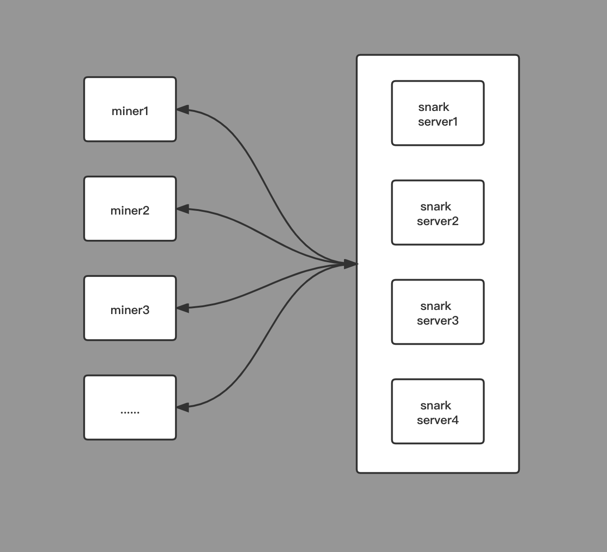
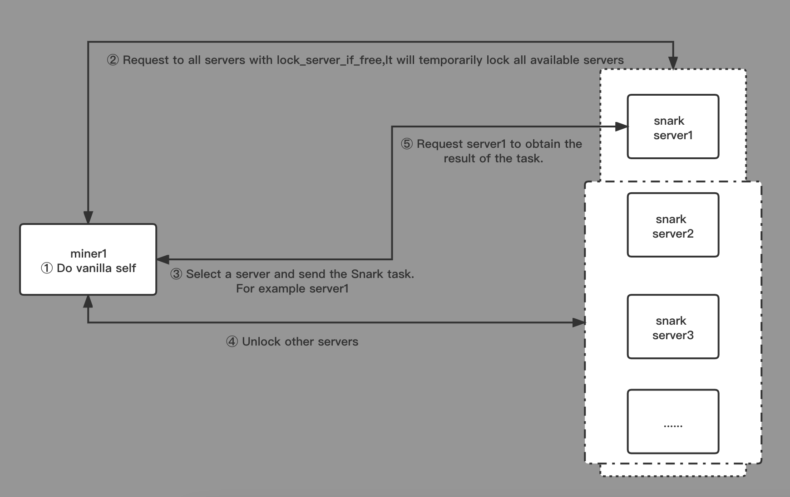

# window-post-snark-server

## What is window-post-snark-server？
window-post-snark-server is the program used to perform Snark Proof tasks in Filecoin.
It's kind of distributed，and supports multiple Miners sharing a set of servers.
If you have many partitions in one deadline, you can use this to distribute tasks to multiple servers at the same time,that maybe can take the pressure off the Miner.

## WARNING
- window-post-snark-server is currently only tested on MacOS and Ubuntu.
- Here only the server side of the code,the client part of the logic may need to be coded according to actual needs.
- Each server is a standalone program,for reliability reasons,there is no scheduler for now,if you need a scheduler, maybe you need code it yourself,or maybe I'll add it in a later update.(anyway,I don't think it's really necessary, you know)

## Design the interaction flow between server and client

